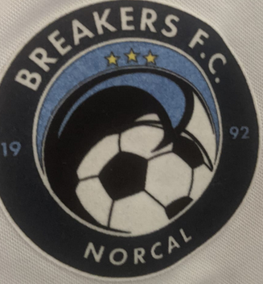
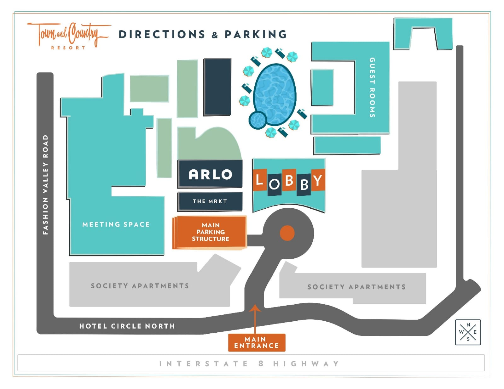

# San Diego ManchesterCup Weekend 5/29/21 - 5/31/21




Table of Contents
=================

* [San Diego ManchesterCup Weekend 5/29/21 - 5/31/21](#san-diego-manchestercup-weekend-52921---53121)
   * [Live Schedule for last minute changes](#live-schedule-for-last-minute-changes)
   * [Game Schedule Team ID #2267](#game-schedule-team-id-2267)
   * [Tournament Data](#tournament-data)
   * [Opponents Details](#opponents-details)
   * [Opponents Rankings](#opponents-rankings)
   * [Hotel Info](#hotel-info)
   * [Roster Details](#roster-details)
   * [Coach Practice / Zoom Plan](#coach-practice--zoom-plan)
   * [Uniforms - Home](#uniforms---home)
   * [Uniforms - Away](#uniforms---away)


## Live Schedule for last minute changes

[https://2021mancitycup.surfcupsports.com/events/schedules/28?team-id=2267](https://2021mancitycup.surfcupsports.com/events/schedules/28?team-id=2267)


## Parking Info

- Parking fees $12 at SoCal Sports Complex | $10 at Surf Cup Sports Park 


## Game Schedule Team ID #2267
Day | Date | Field | GameID | Location | Info
---|---|---|---|---|---
Sat| 5/29 | 8.15am | Field 4 | Game #211 | [3302 Senior Center Drive OceanSide](https://www.google.com/maps/place/SoCal+Sports+Complex/@33.2074698,-117.3163882,15z/data=!4m13!1m7!3m6!1s0x80dc71a75e061f19:0xa309c14551c2d468!2s3302+Senior+Center+Dr,+Oceanside,+CA+92056!3b1!8m2!3d33.2061009!4d-117.3148647!3m4!1s0x80dc71ba760d0159:0x23b942901e77039!8m2!3d33.2060769!4d-117.3207507)   |  Group Round Flight2
Sat| 5/29 | 11.40am | Field 3 | Game #214 | [3302 Senior Center Drive OceanSide](https://www.google.com/maps/place/SoCal+Sports+Complex/@33.2074698,-117.3163882,15z/data=!4m13!1m7!3m6!1s0x80dc71a75e061f19:0xa309c14551c2d468!2s3302+Senior+Center+Dr,+Oceanside,+CA+92056!3b1!8m2!3d33.2061009!4d-117.3148647!3m4!1s0x80dc71ba760d0159:0x23b942901e77039!8m2!3d33.2060769!4d-117.3207507) | Group Round Flight 2
Sun| 5/30 | 10.35am | Field 5 | Game #216 | [3302 Senior Center Drive OceanSide](https://www.google.com/maps/place/SoCal+Sports+Complex/@33.2074698,-117.3163882,15z/data=!4m13!1m7!3m6!1s0x80dc71a75e061f19:0xa309c14551c2d468!2s3302+Senior+Center+Dr,+Oceanside,+CA+92056!3b1!8m2!3d33.2061009!4d-117.3148647!3m4!1s0x80dc71ba760d0159:0x23b942901e77039!8m2!3d33.2060769!4d-117.3207507) |  Group Round Flight 2
Mon | 5/31| 8.20am |  Field 7 or 8|  Game #229 |  [14989 Via De la Valle, Del Mar](https://www.google.com/maps/place/San+Diego+Surf+Soccer+Club+Back+Fields/@32.9842152,-117.222073,17z/data=!4m9!1m2!2m1!1s14989+Via+De+la+Valle,+Del+Mar+soccer!3m5!1s0x0:0xafd4f6820fb40d88!8m2!3d32.9851603!4d-117.2171526!15sCiUxNDk4OSBWaWEgRGUgbGEgVmFsbGUsIERlbCBNYXIgc29jY2VykgELc3BvcnRzX2NsdWI) | Semi Finals, only played based upon previous results
Mon | 5/31|12.20pm | Field 9 | Game #229 | [14989  Via De la Valle, Del Mar](https://www.google.com/maps/place/San+Diego+Surf+Soccer+Club+Back+Fields/@32.9842152,-117.222073,17z/data=!4m9!1m2!2m1!1s14989+Via+De+la+Valle,+Del+Mar+soccer!3m5!1s0x0:0xafd4f6820fb40d88!8m2!3d32.9851603!4d-117.2171526!15sCiUxNDk4OSBWaWEgRGUgbGEgVmFsbGUsIERlbCBNYXIgc29jY2VykgELc3BvcnRzX2NsdWI) | Finals, only played based upon previous results

## Tournament Data
- Manchester CityCup: https://mancitycup.com
- Event: https://2021mancitycup.surfcupsports.com/events/groups/28
- Standing https://2021mancitycup.surfcupsports.com/events/standings/28?flight-id=139&gender=M&age=U12
- Team: https://2021mancitycup.surfcupsports.com/events/schedules/28?team-id=2267

## Opponents Details
- [Team 1: Prime SC 09 Boys National League](https://home.gotsoccer.com/(X(1))/rankings/team.aspx?TeamID=1158574)
- [Team 2: LASC B2009 Zaharie  - 58, 161, CAS:58, R4:284,  1-0-2, 33%)](https://home.gotsoccer.com/(X(1))/rankings/results.aspx?Level=State&Gender=Boys&Age=12&State=CAS&pos=133&hl=897922)
- [Team 3: Sand & Surf Boys 2009 Elite - 19, 1359, CAS: 19, R4:105, 3-1-0, 75%](https://home.gotsoccer.com/(X(1))/rankings/team.aspx?TeamID=1139823)

## Opponents Rankings:
- Team 1: Prime SC
- [Team 2 LASC](https://home.gotsoccer.com/(X(1))/rankings/results.aspx?Level=State&Gender=Boys&Age=12&State=CAS&pos=59&hl=1521544)
- [Team 3 Sand & Surf](https://home.gotsoccer.com/(X(1))/rankings/results.aspx?Level=State&Gender=Boys&Age=12&State=CAS&pos=27&hl=1286574)

## Hotel Info
- [Town and Country San Diego, 500 Hotel Circle North, San Diego, CA 92108](https://www.google.com/maps/place/500+Hotel+Cir+N,+San+Diego)



## Roster Details
Playes FirstName | TelNr
---|---
Sammy | 408 506 7351


## Coach Practice / Zoom Plan
- Coach Mark Christie
```
Coach Plan

Robert Kiernan is inviting you to a scheduled Zoom meeting.

Topic: Virtual Morning Sessions: 7:30am - 8:00am with SCPROSOCCER
Time: May 28, 2021 07:30 AM Pacific Time (US and Canada)

Join Zoom Meeting
https://us02web.zoom.us/j/82125717297

Meeting ID: 821 2571 7297
One tap mobile
+16699009128,,82125717297# US (San Jose)
+13462487799,,82125717297# US (Houston)

Dial by your location
        +1 669 900 9128 US (San Jose)
        +1 346 248 7799 US (Houston)
        +1 253 215 8782 US (Tacoma)
        +1 301 715 8592 US (Washington DC)
        +1 312 626 6799 US (Chicago)
        +1 646 558 8656 US (New York)
Meeting ID: 821 2571 7297
Find your local number: https://us02web.zoom.us/u/kyOjznMx9

```

## Uniforms - Home


## Uniforms - Away

