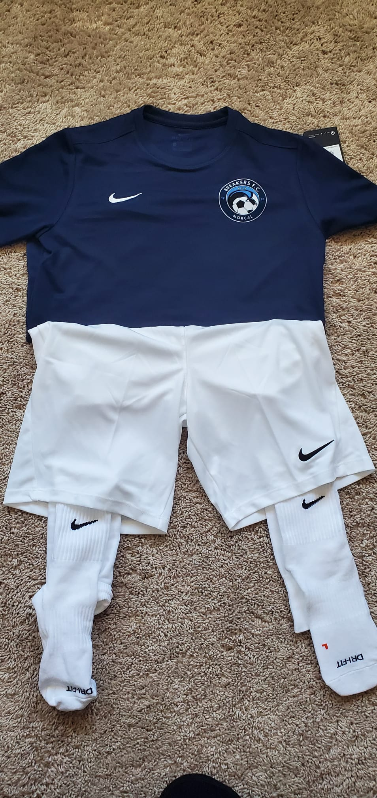

# San Diego ManchesterCup Weekend 5/29/21 - 5/31/21


Table of Contents
=================

* [San Diego ManchesterCup Weekend 5/29/21 - 5/31/21](#san-diego-manchestercup-weekend-52921---53121)
   * [Live Schedule for last minute changes](#live-schedule-for-last-minute-changes)
   * [Game Schedule Team ID #2267](#game-schedule-team-id-2267)
   * [Tournament Data](#tournament-data)
   * [Opponents Ranking](#opponents-ranking)
   * [Opponents Rankings:](#opponents-rankings)
   * [Hotel Info](#hotel-info)
   * [Roster Details](#roster-details)
   * [Coach Practice / Zoom Plan](#coach-practice--zoom-plan)
   * [Uniforms - Home](#uniforms---home)
   * [Uniforms - Away](#uniforms---away)


## Live Schedule for last minute changes

[https://2021mancitycup.surfcupsports.com/events/schedules/28?team-id=2267](https://2021mancitycup.surfcupsports.com/events/schedules/28?team-id=2267)

## Game Schedule Team ID #2267
Day | Date | Field | GameID | Location | Info
---|---|---|---|---|---
Sat| 5/29 | 7.30am | Field 3 | Game #211 | 3302 Senior Center Drive OceanSide   |  Group Round Flight2
Sat| 5/29 | 1.45pm | Field 4 | Game #214 | 3302 Senior Center Drive OceanSide | Group Round Flight 2
Sun| 5/30 |3.00pm | Field 6 | Game #216 | 3302 Senior Center Drive OceanSide |  Group Round Flight 2
Mon | 5/31| 8.00am |  Field 1 or 2|  Game #229 |  14989 Via De la Valle, Del Mar | Semi Finals 
Mon | 5/31|12.45pm | Field 18 | Game #229 | 14989  Via De la Valle, Del Mar | Finals

## Tournament Data
- Manchester CityCup: https://mancitycup.com
- Event: https://2021mancitycup.surfcupsports.com/events/groups/28
- Standing https://2021mancitycup.surfcupsports.com/events/standings/28?flight-id=139&gender=M&age=U12
- Team: https://2021mancitycup.surfcupsports.com/events/schedules/28?team-id=2267

## Opponents Ranking
- [Team 1: Prime SC 09 Boys National League](https://home.gotsoccer.com/(X(1))/rankings/team.aspx?TeamID=1158574)
- [Team 2: LASC B2009 Zaharie  - 58, 161, CAS:58, R4:284,  1-0-2, 33%)](https://home.gotsoccer.com/(X(1))/rankings/results.aspx?Level=State&Gender=Boys&Age=12&State=CAS&pos=133&hl=897922)
- [Team 3: Sand & Surf Boys 2009 Elite - 19, 1359, CAS: 19, R4:105, 3-1-0, 75%](https://home.gotsoccer.com/(X(1))/rankings/team.aspx?TeamID=1139823)

## Opponents Rankings:
- Team 1: Prime SC
- [Team 2 LASC](https://home.gotsoccer.com/(X(1))/rankings/results.aspx?Level=State&Gender=Boys&Age=12&State=CAS&pos=59&hl=1521544)
- [Team 3 Sand & Surf](https://home.gotsoccer.com/(X(1))/rankings/results.aspx?Level=State&Gender=Boys&Age=12&State=CAS&pos=27&hl=1286574)

## Hotel Info
- [Town and Country San Diego, 500 Hotel Circle North, San Diego, CA 92108](https://www.google.com/maps/place/500+Hotel+Cir+N,+San+Diego)

## Roster Details
Playes FirstName | TelNr
---|---
Sammy | 408 506 7351


## Coach Practice / Zoom Plan
- Coach Mark Christie
```
Coach Plan

Rough plan based on this schedule.
Goal: try to get kids into a slightly earlier cycle.
Wednesday try to get your son up early tomorrow and in bed by 9pm 
Thursday 7am zoom 30 minutes
Try to get your son in bed by 8.30 
Friday 7am zoom 30 minutes 
Friday evening 6pm team tactical zoom 
Then try to be in bed by 8pm.
```

## Uniforms - Home


## Uniforms - Away


